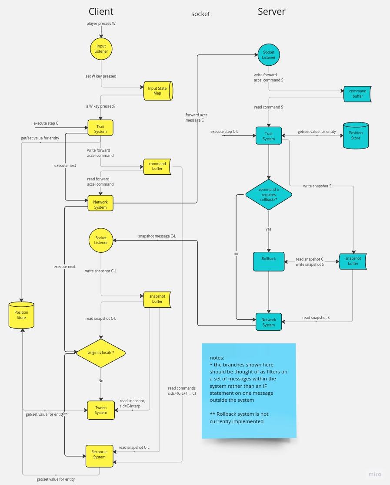

# RTMP Web*

Real-time multiplayer Web framework, for Deno.

NOTE: This project is still in its infancy. This README is mostly for my own benefit, but if you feel so inclined, don't hesitate to clone/fork, poke around... Would be thrilled receive issues/PRs/any feedback.

\* Current working title. Passively looking for a better name.

## Goals and (Planned) High-Level Features

- Authoritative server with client-side prediction, tweening and rollback (sequence diagram below is out of date)
- Support as many devices as possible
- Be efficient w/ regard to power, memory, network
  - Use Web Transport (once it's more widely adopted) instead of Web Sockets.
  - ECS
  - Binary wire format
- DX:
  - Prod-ready HMR
  - Use standard Web APIs on Client and Server, only deviate when it makes sense to do so
  - Leverage TypeScript's powerful type system to help developers write maintainable, robust code.
- Keep it free (as in beer and as in speech)

### Developing

1. Install Deno (I recommend using ASDF)
1. Copy scripts/git_hooks/pre-commit to .git/hooks/pre-commit
2. Run scripts/dev.sh
3. Open localhost:8000 in a browser

### Building

The way the codebase is built and served in production versus development are essentially the same, and relatively simple thanks to the exclusive use ECMAScript's standard module system AKA ES Modules. There is no bundling phase, the build process simply produces one JavaScript file for each TypeScript source file using ESBuild.

### Authoritative Server

Heavily influenced by [Gabriel Gambetta's writing on Client-Server game architecture.](https://www.gabrielgambetta.com/client-server-game-architecture.html)

#### Sequence Diagram (a bit outdated)

[View on Miro](https://miro.com/app/board/uXjVMZ4l_4o=/?share_link_id=837242552602)
